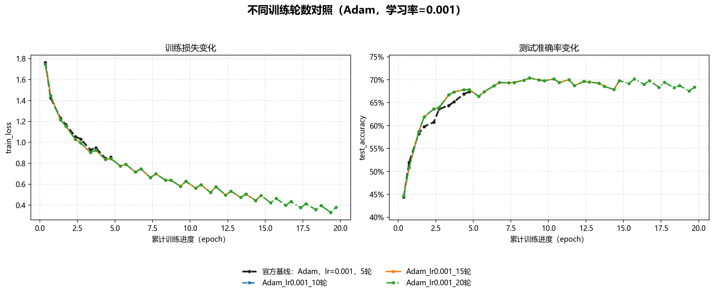
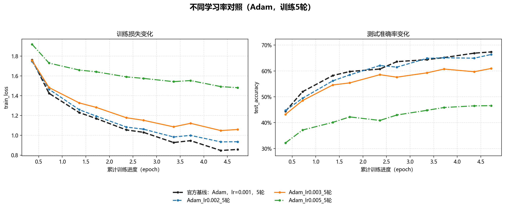
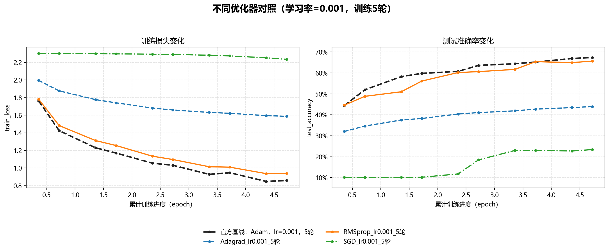

# LeNet 超参数消融实验报告

## 1. 实验目的

本实验基于 LeNet 网络和 CIFAR-10 数据集，通过控制变量法分别改变训练轮数、学习率和优化器，研究不同超参数对模型收敛速度、训练损失以及测试准确率的影响，并确定当前实验条件下较合适的训练配置。

## 2. 实验设置

| 项目 | 设置 |
| --- | --- |
| 数据集 | CIFAR-10 |
| 网络模型 | LeNet |
| 训练集规模 | 50,000 张图像 |
| 测试数据 | CIFAR-10 测试集中的 5,000 张图像 |
| Batch Size | 36 |
| 损失函数 | CrossEntropyLoss |
| 官方基线 | Adam，学习率 0.001，训练 5 轮 |
| 记录频率 | 每 500 个 mini-batch 记录一次训练损失和测试准确率 |
| 随机种子 | 对照实验固定为 42 |

> 表格和图中的 `test_accuracy` 是程序对 `val_loader` 第一个 batch（5,000 张测试图像）计算得到的准确率，并非完整 10,000 张 CIFAR-10 测试集的结果。

本实验共设置三类超参数消融实验：

| 消融类别 | 改变的变量 | 保持不变的条件 |
| --- | --- | --- |
| 训练轮数消融 | 5、10、15、20 轮 | Adam，学习率 0.001 |
| 学习率消融 | 0.001、0.002、0.003、0.005 | Adam，训练 5 轮 |
| 优化器消融 | Adam、SGD、RMSprop、Adagrad | 学习率 0.001，训练 5 轮 |

### 2.1 如何理解这三个超参数

训练神经网络的核心是根据损失函数的梯度更新参数。最简单的梯度下降更新可以写成：

```text
新参数 = 旧参数 - 学习率 × 梯度
```

- **学习率（learning rate）** 决定每次参数更新迈多大一步。过小会收敛慢，过大则可能越过较优解，在较优区域来回震荡。
- **训练轮数（epoch）** 表示模型完整遍历训练集的次数。轮数不足时模型尚未学好，轮数过多时可能只继续记忆训练数据，而不再改善未知数据上的表现。
- **优化器（optimizer）** 决定如何利用当前梯度和历史梯度。不同优化器即使使用相同名义学习率，实际作用在每个参数上的更新步长也可能完全不同。

阅读后续曲线时，需要同时观察 `train_loss` 和 `test_accuracy`：训练损失下降表示模型对训练数据拟合得更好；测试准确率上升才表示泛化性能改善。如果损失继续下降而测试准确率不再上升，通常意味着模型进入收敛平台或开始过拟合。

## 3. 训练轮数消融实验

### 3.1 实验数据

| 训练轮数 | 最终训练损失 | 最低训练损失 | 最终测试准确率 | 最高测试准确率 |
| ---: | ---: | ---: | ---: | ---: |
| 5（官方基线） | 0.8580 | 0.8475 | 67.36% | 67.36% |
| 10 | 0.6281 | 0.5801 | 69.78% | **70.38%** |
| 15 | 0.4912 | 0.4429 | 69.76% | **70.38%** |
| 20 | **0.3788** | **0.3305** | 68.36% | **70.38%** |

### 3.2 数据与图表分析

随着训练轮数增加，训练损失持续下降：最终训练损失由官方 5 轮基线的 0.8580 降低至 20 轮实验的 0.3788，说明模型对训练数据的拟合程度不断提高。测试准确率在前 10 轮提升较快，最高准确率在第 9 轮达到 70.38%。继续训练至 15 轮和 20 轮并未突破这一结果，最终准确率分别为 69.76% 和 68.36%。

图中 10、15、20 轮实验在前 10 轮的曲线基本重合，这是因为三组实验使用了相同的随机种子、初始权重和数据打乱序列。10 轮以后训练损失仍然下降，但测试准确率只在约 68%～70% 之间波动，表明模型已经进入收敛平台。20 轮时训练损失进一步降低而测试准确率反而回落，说明继续增加训练轮数对泛化性能没有明显帮助，并出现了一定的过拟合倾向。因此，当前设置下训练约 10 轮已经能够取得较好的性能和训练成本平衡。

将数值换算成相对变化后，趋势更加清楚：

| 对比 | 最终损失变化 | 最终准确率变化 | 最高准确率变化 | 含义 |
| --- | ---: | ---: | ---: | --- |
| 5轮 → 10轮 | -26.8% | +2.42个百分点 | +3.02个百分点 | 延长到10轮仍有明确泛化收益 |
| 10轮 → 15轮 | -21.8% | -0.02个百分点 | 0 | 只改善训练拟合，测试性能基本不变 |
| 10轮 → 20轮 | -39.7% | -1.42个百分点 | 0 | 训练集继续变好，但最终泛化性能下降 |

第9轮第1000个mini-batch首次达到70.38%的最高准确率，之后再训练11轮仍未突破。这里可以学习到一个重要概念：**最佳模型不一定是最后一轮模型**。实际项目通常会根据验证集准确率保存最佳检查点，并使用 early stopping 在性能长期不再提升时提前停止训练。



## 4. 学习率消融实验

### 4.1 实验数据

| 学习率 | 最终训练损失 | 最低训练损失 | 最终测试准确率 | 最高测试准确率 |
| ---: | ---: | ---: | ---: | ---: |
| **0.001** | **0.8580** | **0.8475** | **67.36%** | **67.36%** |
| 0.002 | 0.9357 | 0.9342 | 66.38% | 66.38% |
| 0.003 | 1.0594 | 1.0485 | 60.96% | 60.96% |
| 0.005 | 1.4813 | 1.4813 | 46.58% | 46.58% |

### 4.2 数据与图表分析

在优化器固定为 Adam、训练轮数固定为 5 的条件下，学习率 0.001 获得了最低的最终训练损失 0.8580 和最高的测试准确率 67.36%。学习率提高到 0.002 后，最终准确率略降至 66.38%；继续提高到 0.003 和 0.005 时，最终准确率分别下降至 60.96% 和 46.58%。

图中学习率 0.001 和 0.002 的损失曲线下降较平稳，准确率随训练进度持续提升。学习率 0.003 的收敛质量开始下降，而学习率 0.005 的损失长期保持在较高水平，准确率提升也明显受限。这说明过大的参数更新步长使模型难以稳定逼近较优解。当前候选值中，0.001 是更合适的学习率。

以学习率0.001为参照，各数值的影响如下：

| 学习率 | 相对损失变化 | 准确率变化 | 现象解释 |
| ---: | ---: | ---: | --- |
| 0.001 | 基准 | 基准 | 更新步长与当前Adam设置匹配 |
| 0.002 | +9.1% | -0.98个百分点 | 仍能正常收敛，但最终解稍差 |
| 0.003 | +23.5% | -6.40个百分点 | 步长偏大，较难精细逼近低损失区域 |
| 0.005 | +72.6% | -20.78个百分点 | 更新过于激进，损失与准确率均明显恶化 |

Adam虽然会为不同参数自适应缩放梯度，但全局学习率仍控制整体更新幅度，因此“使用Adam就不需要调学习率”是错误的。本实验只测试了0.001以上的候选值，只能说明继续增大学习率会变差；若要确认0.001是否真正最优，还可继续测试0.0003、0.0005等更小数值，并比较它们是否需要更多epoch才能收敛。



## 5. 优化器消融实验

### 5.1 实验数据

| 优化器 | 学习率 | 最终训练损失 | 最低训练损失 | 最终测试准确率 | 最高测试准确率 |
| --- | ---: | ---: | ---: | ---: | ---: |
| **Adam** | 0.001 | **0.8580** | **0.8475** | **67.36%** | **67.36%** |
| RMSprop | 0.001 | 0.9387 | 0.9363 | 65.60% | 65.60% |
| Adagrad | 0.001 | 1.5875 | 1.5875 | 43.94% | 43.94% |
| SGD | 0.001 | 2.2349 | 2.2349 | 23.40% | 23.40% |

### 5.2 数据与图表分析

在学习率和训练轮数保持一致时，Adam 的表现最好，最终测试准确率为 67.36%；RMSprop 次之，最终准确率为 65.60%，与 Adam 相差 1.76 个百分点。Adagrad 和 SGD 的最终准确率仅为 43.94% 和 23.40%，收敛速度明显较慢。

从曲线可以看出，Adam 和 RMSprop 的训练损失快速下降，测试准确率同步提升。Adagrad 的损失下降幅度较小，准确率提升缓慢；SGD 在学习率 0.001 下的损失接近 2.3，前期准确率接近随机分类水平，训练 5 轮后也只有 23.40%。Adam 和 RMSprop 都具有自适应学习率调节能力，在当前任务和训练预算下能够更快完成有效参数更新。

需要注意的是，本组实验要求所有优化器使用相同学习率 0.001，而 SGD 通常需要单独调节学习率、动量和训练轮数。因此，该结果只能说明 SGD 在本实验固定配置下表现较弱，不能据此认为 SGD 在所有配置下均劣于自适应优化器。

以Adam为参照，优化器造成的数值影响为：

| 优化器 | 相对损失变化 | 准确率变化 | 当前设置下的学习解释 |
| --- | ---: | ---: | --- |
| Adam | 基准 | 基准 | 同时利用一阶动量和二阶矩估计，更新稳定且较快 |
| RMSprop | +9.4% | -1.76个百分点 | 按梯度平方滑动平均缩放步长，表现接近Adam |
| Adagrad | +85.0% | -23.42个百分点 | 累积平方梯度使有效学习率持续减小，5轮内学习不足 |
| SGD | +160.5% | -43.96个百分点 | 0.001对无动量SGD过小，损失长期接近随机分类的2.303 |

SGD在前两轮准确率约为10%，接近CIFAR-10十分类的随机猜测水平；到第5轮才提高到23.40%。这说明它并非完全不能学习，而是在当前学习率和训练预算内更新太慢。更公平的优化器对比应分别调节各自学习率，例如为SGD测试0.01或0.1，并尝试 `momentum=0.9`。Adagrad的历史梯度平方会不断累积，使后期有效步长越来越小；Adam通过指数滑动平均缓解了这一问题，并额外使用一阶动量，因此在本实验中收敛更快。



## 6. 实验结论与调参建议

本实验分别研究了学习率、训练轮数以及优化器对模型性能的影响。实验结果表明，Adam优化器在当前任务中具有较好的收敛性能。当学习率设置为0.001时，模型取得最高测试准确率，进一步增大学习率会导致训练不稳定，降低模型性能。随着训练轮数增加，模型准确率在前10轮快速提升，随后趋于稳定，说明模型已达到较好的收敛状态。此外，不同优化器对训练效果影响明显，其中Adam和RMSprop由于采用自适应学习率机制，相比SGD和Adagrad表现更优。

综合实验数据，在当前 LeNet、CIFAR-10 数据处理方式和超参数候选范围内，推荐使用 Adam 优化器、学习率 0.001，并将训练轮数设置为约 10 轮。该配置最高测试准确率达到 70.38%，继续延长训练虽然能够降低训练损失，但不会持续提升测试准确率。

三个超参数并不是彼此独立发挥作用：学习率和优化器共同决定更新轨迹，训练轮数决定这种更新持续多久。因此，更合理的调参顺序是：

1. 先选择能稳定训练的优化器，如Adam，使用经验学习率0.001建立基线。
2. 在较少epoch下粗略搜索学习率数量级，排除明显不收敛的范围。
3. 固定较优学习率后增加epoch，观察测试准确率何时进入平台。
4. 保存验证集最佳模型，而不是默认使用最后一轮模型。
5. 若更换优化器，应重新搜索该优化器的学习率和动量，不能机械沿用Adam的0.001。

本实验最值得记住的规律是：**损失更低、训练更久或更新更快，都不自动等于测试准确率更高。** 调参的目标是改善未知数据上的泛化表现，而不是单独追求训练损失最小。

## 7. 实验局限性

- 测试指标只使用固定的5,000张CIFAR-10测试图像，不能完全代表完整测试集。
- 每组只运行一次，没有通过多个随机种子计算均值和标准差，约1个百分点以内的差异需要谨慎解释。
- 官方5轮基线与后续固定随机种子的实验并非完全相同初始化，因此跨批次比较时应重点关注整体趋势。
- 所有优化器使用相同学习率并不完全公平，尤其会低估SGD在合适学习率和动量下的能力。
- 每500个mini-batch记录的loss是最近500批次的平均值，不是整轮训练集的严格epoch平均损失。

## 8. 文件说明与复现方法

| 文件 | 说明 |
| --- | --- |
| `train.py` | 执行官方设置及三类超参数消融实验 |
| `results/hyperparameter_results.xlsx` | 保存全部实验配置和训练记录 |
| `visualize_results.py` | 根据 Excel 数据生成分类对照图 |
| `results/models/` | 保存各组实验模型权重 |
| `results/figures/` | 保存训练轮数、学习率和优化器对照图 |

运行训练与绘图：

```powershell
python train.py
python visualize_results.py
```
