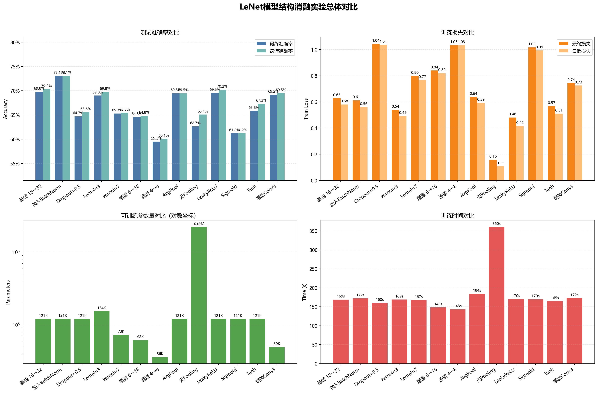
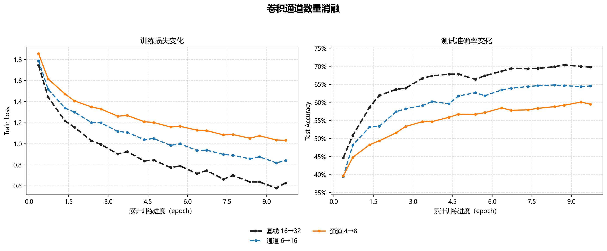
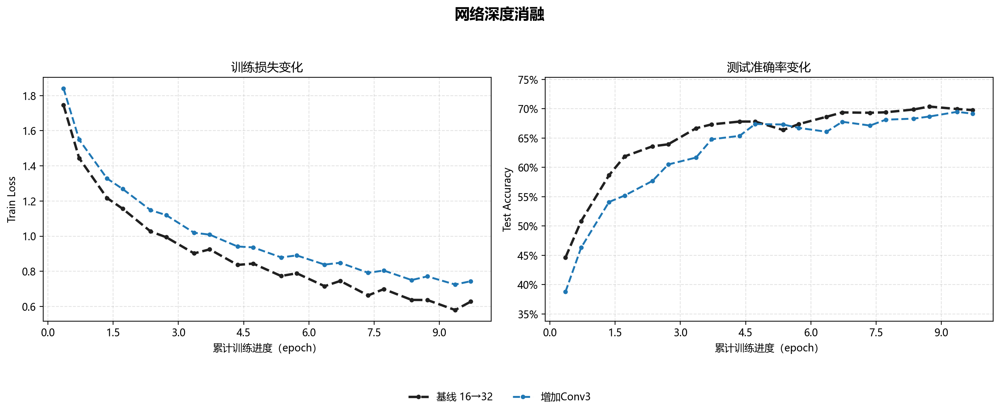
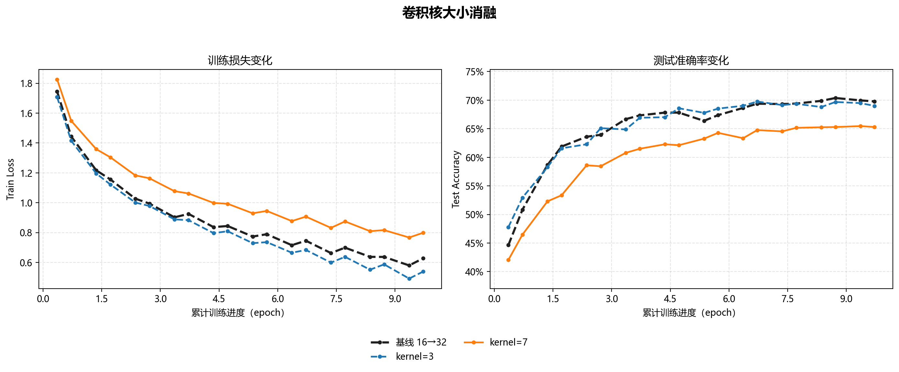
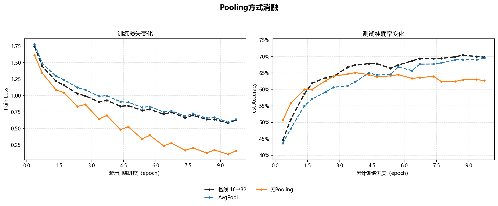
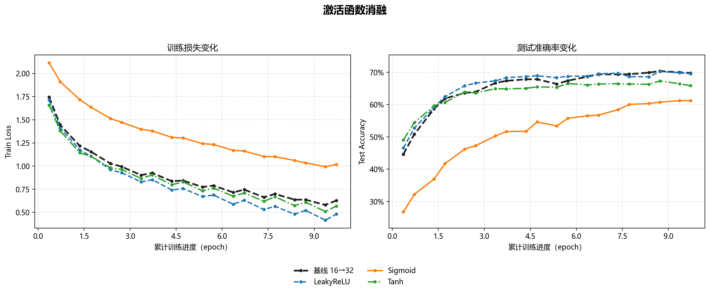
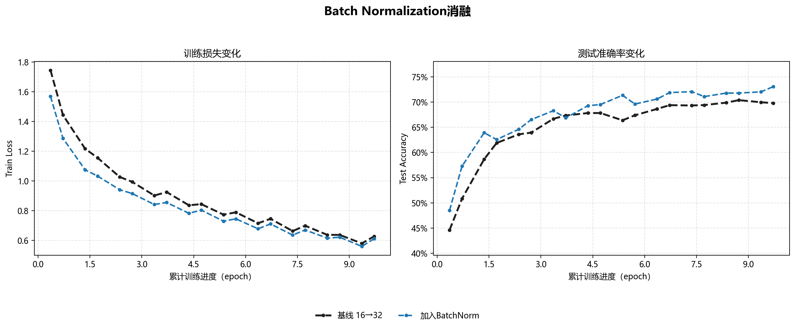
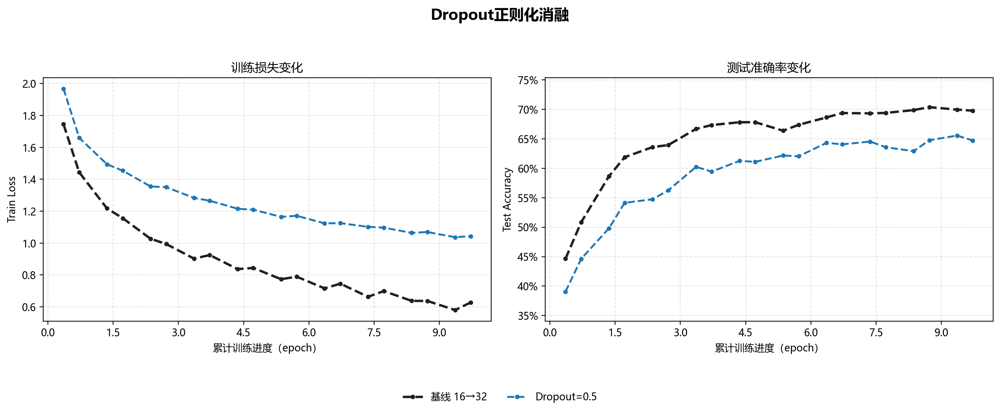

# LeNet 模型结构消融实验

## 1. 实验目的

本实验在现有 CIFAR-10 LeNet 项目基础上，使用控制变量法研究卷积通道数、网络深度、卷积核大小、池化方式、激活函数、Batch Normalization 和 Dropout 对模型参数量、收敛速度、训练损失及测试准确率的影响。

实验重点是验证不同网络结构设计造成的性能变化，不以追求最高准确率为目标。

## 2. 与现有超参数实验的隔离

本目录是独立的模型结构实验，不会导入或修改相邻 `hyperparameter_experiment/` 中的 `model.py`、`train.py`、超参数实验 Excel 和模型权重。

```text
model_structure_experiment/
├── model_structure.py          # 独立模型及13个结构配置
├── train_structure.py          # 独立训练、评价和结果记录脚本
├── visualize_structure_results.py # 结果可视化脚本
├── README.md                   # 本实验说明
└── results/                    # 结构消融结果目录
    ├── model_structure_results.xlsx  # 训练明细与汇总数据
    ├── summary.md                    # 自动生成的最终汇总表
    ├── models/                       # 各组模型权重
    └── figures/                      # 总体图及七类消融图
```

数据集不重复复制。`train_structure.py` 只读取上级目录现有的 `data/`，并复用相同的数据变换、Dataset、DataLoader 和测试流程。

## 3. 当前真实基线说明

只读检查确认，超参数实验中的 `../hyperparameter_experiment/model.py` 真实结构为：

```text
输入：RGB图像，3通道，32×32
Conv1：3 → 16，kernel_size=5
MaxPool2d
Conv2：16 → 32，kernel_size=5
MaxPool2d
FC：800 → 120 → 84 → 10
激活函数：ReLU
BatchNorm：无
Dropout：无
```

这与经典灰度 LeNet 的 `1→6→16` 不同。为了保持当前项目基线不变，本实验以 `3→16→32` 为 `baseline_current`。题目中的 `1→4→8` 和 `1→6→16` 按 CIFAR-10 RGB 输入调整为 `3→4→8` 和 `3→6→16`；题目中的增容组 `16→32` 已经是当前实际基线，因此不创建重复模型。

## 4. 固定训练与评价条件

| 项目 | 固定设置 |
| --- | --- |
| Dataset | CIFAR-10 |
| 数据归一化 | mean=(0.5, 0.5, 0.5)，std=(0.5, 0.5, 0.5) |
| Batch Size | 36 |
| 测试批次 | 5,000张，shuffle=False |
| Optimizer | Adam |
| Learning Rate | 0.001 |
| Epoch | 10 |
| Loss | CrossEntropyLoss |
| 随机种子 | 42 |
| 记录间隔 | 每500个mini-batch |

每组实验都会重新初始化模型，并使用相同随机种子。除所研究的结构因素外，其他设置保持一致。

## 5. 实验配置与修改位置

所有配置集中定义在 `model_structure.py` 的 `MODEL_CONFIGS` 中；模型公共逻辑位于 `LeNetStructure`。后续增加实验时，只需添加一个配置项，不需要复制整套网络代码。

| 配置名 | 类别 | 相对当前基线的修改 | 可训练参数量 |
| --- | --- | --- | ---: |
| `baseline_current` | 基线 | 当前3→16→32结构 | 121,182 |
| `channel_reduced_4_8` | 通道 | 通道改为3→4→8 | 36,246 |
| `channel_classic_6_16` | 通道 | 通道改为3→6→16 | 62,006 |
| `depth_add_conv` | 深度 | 增加Conv3(k=3,p=1)+Pool | 49,790 |
| `kernel_size_3` | 卷积核 | 两个基础卷积核由5改为3 | 154,462 |
| `kernel_size_7` | 卷积核 | 两个基础卷积核由5改为7 | 73,182 |
| `pooling_avg` | 池化 | MaxPool改为AvgPool | 121,182 |
| `pooling_none` | 池化 | 取消Pooling | 2,237,022 |
| `activation_sigmoid` | 激活函数 | ReLU改为Sigmoid | 121,182 |
| `activation_tanh` | 激活函数 | ReLU改为Tanh | 121,182 |
| `activation_leaky_relu` | 激活函数 | ReLU改为LeakyReLU | 121,182 |
| `batch_norm` | BatchNorm | 卷积后加入BatchNorm2d | 121,278 |
| `dropout_0_5` | Dropout | FC隐藏层后加入Dropout(0.5) | 121,182 |

Linear 输入维度通过一次虚拟前向传播自动推断，因此卷积核、深度或池化方式变化后无需手工计算展平尺寸。取消池化会显著扩大 FC 输入和参数量，脚本仍可运行，但预计训练耗时会明显增加。

### 5.1 各组对照关系

- 卷积通道：`channel_reduced_4_8`、`channel_classic_6_16`、`baseline_current`。
- 网络深度：`depth_add_conv` 与 `baseline_current`。
- 卷积核大小：`kernel_size_3`、`baseline_current`（k=5）、`kernel_size_7`。
- Pooling：`pooling_avg`、`pooling_none` 与 `baseline_current`（MaxPool）。
- 激活函数：`activation_sigmoid`、`activation_tanh`、`activation_leaky_relu` 与 `baseline_current`（ReLU）。
- BatchNorm：`batch_norm` 与 `baseline_current`（无BN）。
- Dropout：`dropout_0_5` 与 `baseline_current`（无Dropout）。

### 5.2 如何计算尺寸与参数量

理解结构消融时，不能只看“增加了几层”，还要追踪特征图尺寸，因为LeNet的大部分参数可能来自卷积输出后的第一个全连接层。

无padding、步长为1的卷积输出尺寸为：

```text
输出尺寸 = 输入尺寸 - kernel_size + 1
```

一个普通卷积层的参数量为：

```text
卷积参数量 = (输入通道 × kernel_size² + 1个bias) × 输出通道
```

一个全连接层的参数量为：

```text
全连接参数量 = 输入特征数 × 输出特征数 + 输出bias数
```

当前基线的空间尺寸传播为：

```text
32×32
→ Conv5: 28×28
→ MaxPool: 14×14
→ Conv5: 10×10
→ MaxPool: 5×5
→ Flatten: 32×5×5 = 800
→ FC1: 800→120
```

因此，结构修改如果改变最终特征图尺寸，就会显著改变 `FC1` 的输入维度和参数量。例如取消Pooling后，展平维度变成 `32×24×24=18,432`，仅FC1就需要约221万个权重；这也是无Pooling模型参数暴涨的主要原因。

BatchNorm对每个通道学习缩放系数γ和平移系数β，因此两个卷积层增加的可训练参数恰好为：

```text
2×16 + 2×32 = 96
```

激活函数、Pooling和Dropout本身通常没有可训练参数，但它们仍会显著影响梯度传播、信息保留、特征尺寸和泛化性能。

### 5.3 如何阅读结果图

- 左图训练损失下降越快，说明该结构越容易拟合训练数据，但不能单独据此判断模型更好。
- 右图测试准确率代表泛化能力，是比较模型结构效果的主要指标。
- “最佳准确率”是整个训练过程中出现的最高值，“最终准确率”是最后一个记录点的值。两者差距较大时，说明后期训练可能发生波动或过拟合。
- 如果训练损失明显下降而测试准确率下降，应优先考虑过拟合、信息丢失或结构与训练超参数不匹配，而不是继续盲目增加参数。

## 6. 实验结果汇总

全部13组实验均已完成，共得到260条训练过程记录。`model_structure_results.xlsx` 中的 `training_log` 保存每500个mini-batch的训练损失、测试准确率和累计时间，`summary` 保存各配置的最终指标。

| 配置 | 参数量 | 最终准确率 | 最佳准确率 | 最终损失 | 训练时间/s |
| --- | ---: | ---: | ---: | ---: | ---: |
| `baseline_current` | 121,182 | 69.78% | 70.38% | 0.6281 | 168.7 |
| `channel_reduced_4_8` | 36,246 | 59.50% | 60.08% | 1.0331 | 143.2 |
| `channel_classic_6_16` | 62,006 | 64.54% | 64.82% | 0.8400 | 148.2 |
| `depth_add_conv` | 49,790 | 69.16% | 69.48% | 0.7441 | 172.3 |
| `kernel_size_3` | 154,462 | 69.00% | 69.76% | 0.5393 | 168.8 |
| `kernel_size_7` | 73,182 | 65.30% | 65.46% | 0.7990 | 167.2 |
| `pooling_avg` | 121,182 | 69.46% | 69.46% | 0.6385 | 184.0 |
| `pooling_none` | 2,237,022 | 62.66% | 65.08% | **0.1583** | 360.2 |
| `activation_sigmoid` | 121,182 | 61.22% | 61.22% | 1.0164 | 169.6 |
| `activation_tanh` | 121,182 | 65.84% | 67.30% | 0.5679 | 164.5 |
| `activation_leaky_relu` | 121,182 | 69.54% | 70.20% | 0.4807 | 170.0 |
| `batch_norm` | 121,278 | **73.06%** | **73.06%** | 0.6122 | 172.0 |
| `dropout_0_5` | 121,182 | 64.72% | 65.56% | 1.0434 | 159.8 |

总体结果表明，最低训练损失不等同于最佳泛化性能，参数量增加也不会必然提高准确率。加入 BatchNorm 获得最高最终准确率73.06%；取消池化获得最低训练损失0.1583，但测试准确率仅62.66%，参数量和训练时间均为所有配置中最高。



## 7. 各组消融实验分析

### 7.1 卷积通道数量

通道规模从 `3→4→8`、`3→6→16` 增加到基线 `3→16→32` 时，最终准确率依次为59.50%、64.54%和69.78%，呈单调上升；相应参数量由36,246增加到62,006和121,182。曲线显示通道较少的模型在整个训练阶段都保持更高损失和更低准确率，说明其特征容量不足，而不是单纯收敛较慢。

增加通道数在本实验范围内确实增强了特征提取能力，但也带来参数量和训练时间增长。`3→6→16` 只使用约51%的基线参数，最终准确率降低5.24个百分点，可作为模型压缩与性能之间的折中；若优先考虑准确率，当前 `3→16→32` 更合适。

从参数比例看，`3→4→8` 和 `3→6→16` 分别比基线减少70.09%和48.83%的参数，训练时间分别缩短约15.1%和12.1%，但最终准确率也分别下降10.28和5.24个百分点。卷积通道可以理解为一层能够同时学习的特征类型数量：通道太少时，边缘、纹理、颜色组合等不同模式必须共享有限的特征图，容易形成表示瓶颈。通道增加带来的收益不是免费的，后续层的卷积核数量和FC输入也会同步增长，因此实际设计需要在精度、显存和速度之间取舍。



### 7.2 网络深度

增加 `Conv3(k=3,p=1)+MaxPool` 后，最终准确率为69.16%，比基线低0.62个百分点；最佳准确率为69.48%，也未超过基线的70.38%。其最终损失0.7441高于基线0.6281，训练时间则略增至172.3秒。

该深度配置没有带来性能提升。原因可能是第三次池化进一步压缩空间信息，同时自动调整后的FC输入显著缩小，使总参数量反而从121,182降至49,790。因此，本结果说明“当前新增卷积层及下采样组合”收益有限，不能简单推广为增加任意网络深度都无效。

这里有一个容易误解的现象：虽然增加了一层卷积，但总参数量反而减少58.91%。新增Conv3约增加9千个卷积参数，而第三次池化把分类头输入从800维缩小到128维，使FC1减少约8万个参数，减少量超过新增卷积参数。该模型用约41%的基线参数保留了69.48%的最佳准确率，仅比基线低0.90个百分点，实际上是一个很有价值的轻量化折中。若要更严格研究“深度”本身，可增加Conv3但不再池化，或使用Adaptive Pooling固定分类头输入，以避免深度与下采样同时变化。



### 7.3 卷积核大小

`kernel_size=3` 的最终准确率为69.00%，只比基线 `kernel_size=5` 低0.78个百分点，并取得更低的最终训练损失0.5393；但参数量增加到154,462。更低的训练损失没有转化为更高测试准确率，说明其对训练集拟合更充分，但泛化收益有限。

`kernel_size=7` 的最终准确率下降至65.30%，比基线低4.48个百分点。无padding卷积下，大卷积核会更快缩小特征图，使展平维度和参数量减少，同时可能过早丢失局部空间信息。综合准确率、损失和参数量，`kernel_size=5` 在当前结构中取得更好的平衡。

需要注意，卷积核越小并不一定意味着整个网络参数越少。`kernel_size=3` 的卷积核自身较小，但最终特征图为 `32×6×6`，FC1输入扩大到1,152维，使总参数量比基线增加27.46%；`kernel_size=7` 最终只有 `32×3×3`，FC1输入缩小到288维，总参数量反而减少39.61%。3×3模型最终损失比基线低14.1%，但最终准确率低0.78个百分点，说明新增参数主要增强了训练集拟合，并未改善泛化。这个结果展示了为什么分析CNN参数量时必须把卷积层和分类头一起计算。



### 7.4 Pooling方式

AvgPool 与 MaxPool 的表现接近：最终准确率分别为69.46%和69.78%，仅相差0.32个百分点，损失曲线也较接近。这说明两种下采样方式在当前任务中都有效，但 MaxPool 略能保留更有判别力的局部响应，并且训练时间更短。

取消Pooling后，参数量由121,182激增到2,237,022，约为基线的18.5倍，训练时间由168.7秒增加到360.2秒。其最终训练损失低至0.1583，但最终准确率只有62.66%，且最佳准确率65.08%出现在更早阶段，表现出明显过拟合。Pooling不仅降低计算量，也在当前模型中提供了必要的空间压缩和正则化作用。

AvgPool不改变参数量，但训练时间比MaxPool增加约9.1%，最终准确率只低0.32个百分点，说明两者在该浅层网络中功能接近。MaxPool保留局部最大响应，适合突出强边缘和显著纹理；AvgPool保留局部均值，输出更平滑，但可能削弱少量强判别特征。无Pooling模型参数增加1746%、耗时增加113.6%，最终准确率却下降7.12个百分点，是“模型更大不等于性能更好”的最直观例子。



### 7.5 激活函数

ReLU基线最终准确率为69.78%，LeakyReLU为69.54%，二者几乎相当；LeakyReLU的最佳准确率70.20%也接近基线70.38%，并获得更低训练损失0.4807。说明在当前浅层网络中，LeakyReLU可以有效训练，但其减少负区间神经元失活的优势没有明显转化为更高测试准确率。

Tanh最终准确率为65.84%，Sigmoid仅61.22%。从曲线看，Sigmoid的损失下降最慢、准确率长期落后，符合饱和区梯度较小导致优化困难的特征。Tanh优于Sigmoid但仍不及ReLU系列。因此，当前配置下应优先选择ReLU或LeakyReLU。

四种激活函数的差异主要来自梯度传播：Sigmoid把输出压缩到0～1，当输入绝对值较大时导数接近0，深层反向传播容易出现梯度衰减；Tanh输出以0为中心，但两端同样存在饱和问题；ReLU在正区间梯度恒为1，计算简单、收敛较快，但负区间梯度为0；LeakyReLU为负区间保留0.01斜率，减少神经元长期不激活的风险。LeakyReLU最终损失比ReLU低23.5%，但最佳准确率只低0.18个百分点，说明它提高了训练拟合能力，却没有显著改变泛化上限。



### 7.6 Batch Normalization

加入BatchNorm后，最终和最佳准确率均达到73.06%，分别比基线最终准确率和最佳准确率提高3.28和2.68个百分点，是全部结构配置中的最佳结果。模型仅增加96个可训练参数，训练时间增加约3.3秒，额外成本很小。

准确率曲线显示BatchNorm模型在训练中后期持续高于基线，说明其改善了特征分布和优化稳定性，而不是只带来某个检查点的随机峰值。就本实验结果而言，在卷积层后加入BatchNorm是收益最明确的结构修改。

量化来看，BatchNorm只增加0.079%的参数、训练时间增加约1.95%，却使最终准确率提高3.28个百分点、最佳准确率提高2.68个百分点，参数效率远高于直接扩大模型。训练时，BatchNorm按mini-batch标准化中间特征，再用可学习的γ和β恢复合适分布，使不同层接收到的输入尺度更稳定，从而改善梯度传播。推理时使用训练过程中累计的均值和方差，因此应正确切换 `model.train()` 与 `model.eval()`；本实验训练脚本已经进行了这一切换。



### 7.7 Dropout正则化

在两个FC隐藏层后加入 `Dropout(p=0.5)` 后，最终准确率为64.72%，比基线低5.06个百分点；最终训练损失升至1.0434，曲线在10轮内始终明显落后于基线。这表明0.5的丢弃率对当前规模的LeNet正则化过强，在固定10轮训练预算下造成欠拟合或尚未充分收敛。

本实验不能据此否定Dropout本身的作用，只能说明 `p=0.5` 与当前网络、学习率和训练轮数的组合不合适。后续可测试较小丢弃率（如0.2或0.3）或适当延长训练时间。

Dropout没有增加可训练参数，但训练时会随机将约50%的隐藏单元置零，相当于每个mini-batch训练不同的子网络。它通常用于抑制大型网络的共适应，但当前LeNet只有约12万参数，且只训练10轮，`p=0.5` 可能使有效容量过小。其最终损失比基线高66.1%，最佳准确率低4.82个百分点，曲线更像欠拟合或收敛不足，而不是“训练集很好、测试集变差”的典型过拟合。调节Dropout时应同时观察训练损失：若训练损失本身明显偏高，应先减小p或增加训练轮数。



## 8. 综合结论

1. **BatchNorm收益最明确。** 仅增加96个参数便将最终准确率由69.78%提高到73.06%，是当前最值得保留的结构修改。
2. **适当通道容量是准确率的重要基础。** 通道数减少会持续降低特征提取能力；`3→6→16` 可用于轻量化，但需要接受5.24个百分点的最终准确率损失。
3. **增加深度不一定改善性能。** 当前新增卷积层同时引入额外池化，准确率略降，说明深度、空间分辨率和分类头容量需要联合设计。
4. **卷积核5×5在当前无padding LeNet中更均衡。** 3×3拟合训练集更充分但泛化未提升，7×7则因空间压缩过快而明显降低准确率。
5. **Pooling不可简单取消。** 无Pooling配置参数和耗时大幅增加，并出现训练损失很低、测试准确率较差的过拟合现象；MaxPool略优于AvgPool。
6. **ReLU与LeakyReLU最适合当前训练设置。** Sigmoid收敛明显较慢，Tanh居中，LeakyReLU与ReLU性能接近。
7. **Dropout需要结合模型规模和训练预算调节。** 当前 `p=0.5` 过强，在10轮内没有带来泛化提升。

综合准确率、模型规模与训练成本，当前实验建议以 `3→16→32、kernel_size=5、MaxPool、ReLU` 为基础结构，并在卷积层后加入BatchNorm。该配置方向在仅小幅增加计算成本的情况下获得了最明显的泛化改善。

从学习角度，可以把结构选择总结为以下顺序：先保证特征图尺寸和通道容量足以表达任务，再使用Pooling控制空间规模，然后选择容易优化的激活函数；在此基础上使用BatchNorm稳定训练。Dropout等正则化手段应在确认模型确实过拟合后再加入，并根据网络大小调节强度。任何结构修改都应同时比较参数量、训练损失、测试准确率和训练时间，不能只看其中一个指标。

## 9. 结论适用范围

- 测试准确率基于固定的5,000张CIFAR-10测试图像，而非完整10,000张测试集。
- 每个配置只使用一个固定随机种子，没有进行多次重复实验和置信区间估计。
- 所有结构统一使用Adam、学习率0.001和10轮训练，不同结构的最优训练超参数可能不同。
- 部分结构修改会同时改变展平特征维度和参数量，因此结论反映的是完整配置变化，而不是严格控制模型容量后的单独因素效应。

因此，上述结论适用于本次实验环境，可作为后续结构设计依据，但不应直接推广到所有数据集或训练配置。

## 10. 运行与复现方法

先查看全部配置，不启动训练：

```powershell
python train_structure.py --list
```

运行全部13组实验：

```powershell
python train_structure.py
```

只运行指定实验，例如先运行基线和通道消融：

```powershell
python train_structure.py --experiments baseline_current channel_reduced_4_8 channel_classic_6_16
```

重新运行某一配置时，脚本会先删除该配置在结构消融结果表中的旧记录，避免产生重复数据；其他已完成实验结果不会被覆盖。

重新生成全部图表：

```powershell
python visualize_structure_results.py
```
