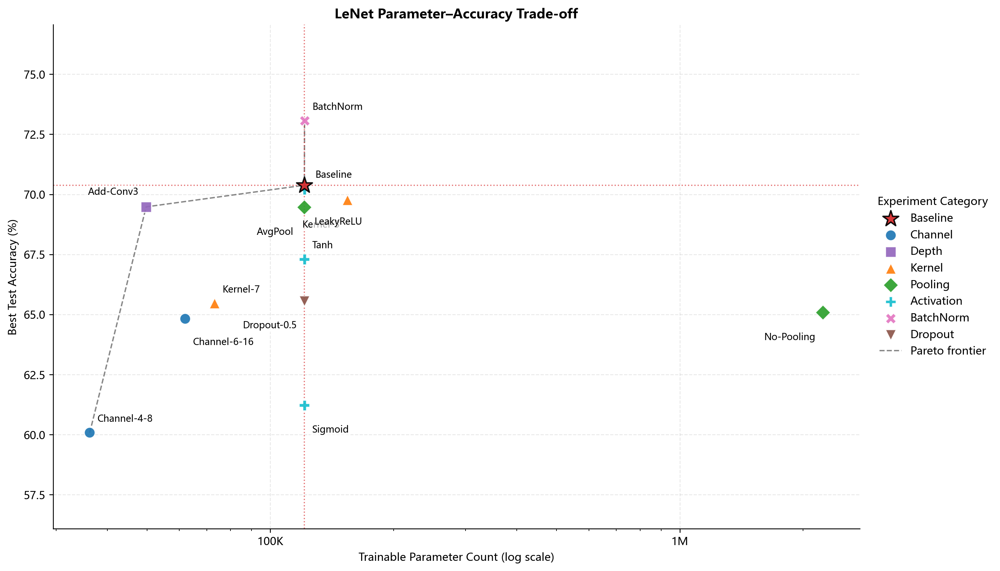
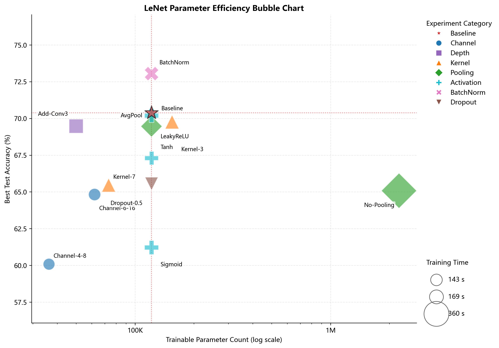

# LeNet模型参数量—测试准确率效率分析报告

## 1. 实验目的

本分析基于已完成的LeNet结构消融实验，研究可训练参数量、最佳测试准确率和训练时间之间的关系。分析不重新训练模型，也不修改原始结果。数据源为 `D:\DeepLearn_Study\deep-learning-for-image-processing\LeNet_experiment\model_structure_experiment\results\model_structure_results.xlsx`，Accuracy统一读取“最佳测试准确率”。

以 `baseline_current` 为基线，参数增长比例、Accuracy变化和参数效率分别定义为：

- 参数增长比例：`(parameters_new - parameters_baseline) / parameters_baseline`。
- Accuracy变化：`accuracy_new - accuracy_baseline`，报告中以百分点表示。
- Accuracy提升比例：`(accuracy_new - accuracy_baseline) / accuracy_baseline`。
- 参数效率：`Accuracy提升比例 / 参数增长比例`。参数量不变时该值记为N/A；减参模型的正值表示“参数减少比例大于准确率损失比例”，不等同于准确率提升。

## 2. 数据统计表

| Model | Category | Parameters | Best Accuracy | Training Time | Pareto |
| --- | --- | ---: | ---: | ---: | :---: |
| Baseline | Baseline | 121,182 | 70.38% | 168.7 s | ✓ |
| Channel-4-8 | Channel | 36,246 | 60.08% | 143.2 s | ✓ |
| Channel-6-16 | Channel | 62,006 | 64.82% | 148.2 s |  |
| Add-Conv3 | Depth | 49,790 | 69.48% | 172.3 s | ✓ |
| Kernel-3 | Kernel | 154,462 | 69.76% | 168.8 s |  |
| Kernel-7 | Kernel | 73,182 | 65.46% | 167.2 s |  |
| AvgPool | Pooling | 121,182 | 69.46% | 184.0 s |  |
| No-Pooling | Pooling | 2,237,022 | 65.08% | 360.2 s |  |
| Sigmoid | Activation | 121,182 | 61.22% | 169.6 s |  |
| Tanh | Activation | 121,182 | 67.30% | 164.5 s |  |
| LeakyReLU | Activation | 121,182 | 70.20% | 170.0 s |  |
| BatchNorm | BatchNorm | 121,278 | 73.06% | 172.0 s | ✓ |
| Dropout-0.5 | Dropout | 121,182 | 65.56% | 159.8 s |  |

全部模型的 `log10(参数量)` 与最佳准确率的Pearson相关系数为 **0.078**。这反映当前13个配置的整体关联，但不能作为参数量导致准确率变化的因果证据。

## 3. 最佳性能模型

**BatchNorm** 获得最高最佳测试准确率 **73.06%**，参数量为 **121,278**，训练时间为 **172.0 s**。相较Baseline，其准确率变化为 **+2.68个百分点**，参数量变化为 **+0.08%**。

该模型以很小的参数增量获得明确性能提升，说明结构设计和优化稳定性比单纯扩大模型规模更重要。

## 4. 参数效率最高模型

| Model | Parameter Growth | Accuracy Change | Accuracy Growth | Efficiency |
| --- | ---: | ---: | ---: | ---: |
| Baseline | +0.00% | +0.00 pp | +0.00% | N/A |
| Channel-4-8 | -70.09% | -10.30 pp | -14.63% | 0.209 |
| Channel-6-16 | -48.83% | -5.56 pp | -7.90% | 0.162 |
| Add-Conv3 | -58.91% | -0.90 pp | -1.28% | 0.022 |
| Kernel-3 | +27.46% | -0.62 pp | -0.88% | -0.032 |
| Kernel-7 | -39.61% | -4.92 pp | -6.99% | 0.176 |
| AvgPool | +0.00% | -0.92 pp | -1.31% | N/A |
| No-Pooling | +1746.00% | -5.30 pp | -7.53% | -0.004 |
| Sigmoid | +0.00% | -9.16 pp | -13.02% | N/A |
| Tanh | +0.00% | -3.08 pp | -4.38% | N/A |
| LeakyReLU | +0.00% | -0.18 pp | -0.26% | N/A |
| BatchNorm | +0.08% | +2.68 pp | +3.81% | 48.068 |
| Dropout-0.5 | +0.00% | -4.82 pp | -6.85% | N/A |

在“参数增加且准确率提高”的模型中，**BatchNorm** 的题设参数效率最高，效率比值为 **48.068**。其参数只增加 **+0.08%**，Accuracy提高 **+2.68个百分点**。

Pareto前沿模型为：Channel-4-8、Add-Conv3、Baseline、BatchNorm。这些模型不存在“参数更少且准确率不低”的其他配置，代表不同模型规模下的有效折中点。

## 5. 结构分析

- **BatchNorm：** 仅增加96个参数（+0.08%），最佳准确率提高+2.68个百分点，是最典型的高参数效率修改。
- **Dropout：** 参数量不变，但最佳准确率变化-4.82个百分点；在固定10轮训练和p=0.5下，正则化收益有限。
- **卷积核：** Kernel-3增加+27.46%参数但准确率变化-0.62个百分点；Kernel-7因无padding卷积使展平维度缩小，参数反而减少39.61%，准确率下降4.92个百分点。参数变化主要来自后续FC输入尺寸，而不只是卷积核本身。
- **通道数量：** Channel-4-8和Channel-6-16分别减少70.09%和48.83%参数，同时损失10.30和5.56个百分点。通道增加能提升容量，但轻量化配置提供了可选择的精度—规模折中。
- **增加Conv3：** 参数减少58.91%而最佳准确率只下降0.90个百分点，位于Pareto前沿。额外池化缩小FC输入，使其成为比Channel-6-16更有效的紧凑配置，但本结果同时包含“增深”和“进一步下采样”的共同影响。
- **取消Pooling：** 参数增长+1746.00%、训练时间达到360.2 s，但最佳准确率变化-5.30个百分点，属于显著增加计算成本却收益为负的结构。

气泡图中，理想模型位于左上方且气泡较小，即参数少、准确率高、训练时间短。Add-Conv3在紧凑模型中表现突出；BatchNorm位于Baseline附近但准确率更高；No-Pooling位于最右侧且气泡最大，计算成本最高但性能没有改善。

## 6. 总结

实验结果否定了“增加参数一定提升性能”的假设。No-Pooling将参数量提高到Baseline的约18.5倍，却降低测试准确率；Kernel-3也在增加参数后未获得准确率提升。相反，BatchNorm几乎不改变参数规模便取得全组最高准确率，说明有效的特征归一化和优化稳定性比盲目扩容更重要。

从trade-off角度看：若追求最高性能，BatchNorm是最佳选择；若追求紧凑模型，Add-Conv3以约41%的Baseline参数保留了接近Baseline的准确率；若需要更小规模，可进一步选择Channel-4-8或Channel-6-16并接受相应精度损失。

> 结论仅适用于当前CIFAR-10测试方法、单一随机种子、Adam、学习率0.001和10轮训练设置。不同结构可能具有不同的最优超参数，训练时间也会受硬件与系统负载影响。
