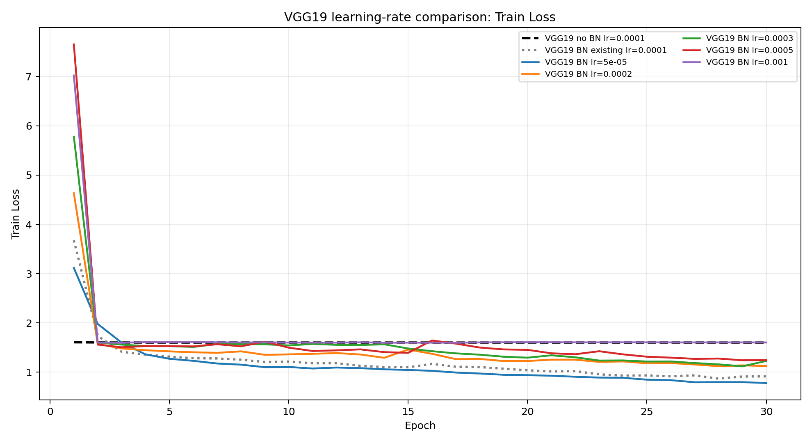
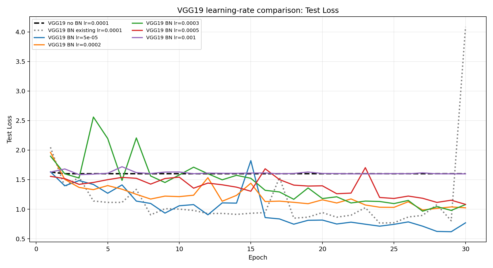
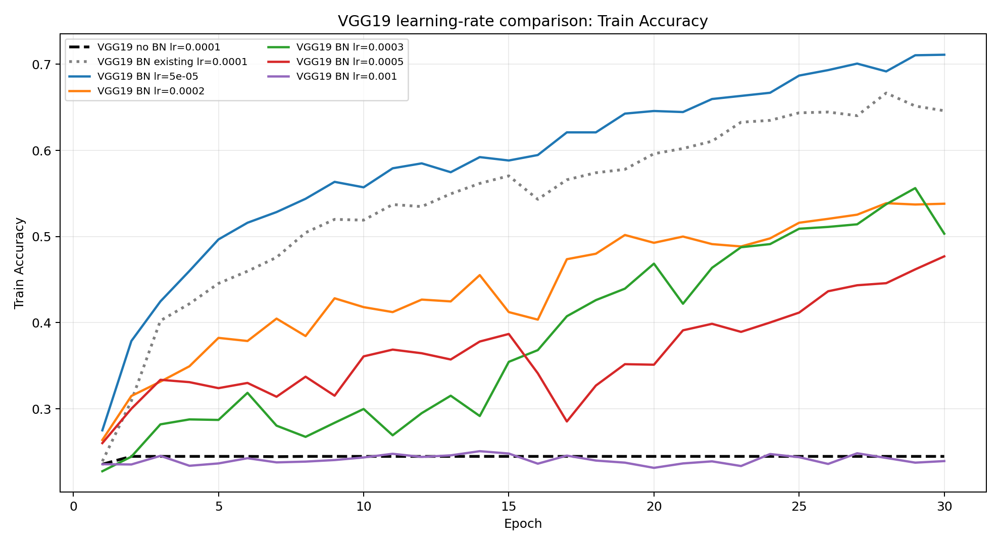
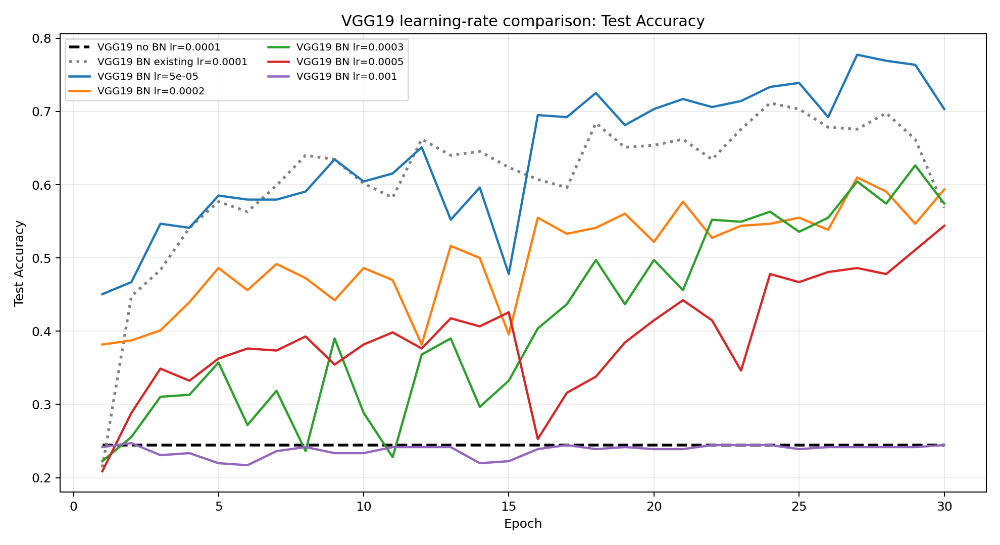

# VGG19 + BatchNorm 学习率实验报告

## 1. 实验目的

研究不同learning rate对VGG19+BatchNorm训练稳定性、收敛速度和分类性能的影响，并与已有VGG19无BatchNorm结果进行比较，判断是否存在更合适的学习率、较大学习率是否导致震荡、较小学习率是否减慢收敛，以及BatchNorm是否扩大深层VGG的有效学习率范围。

## 2. 实验设置

- 数据集：五分类花卉数据集，训练集3306张，固定留出集364张。
- 模型：VGG19；BN组卷积块为`Conv2d -> BatchNorm2d -> ReLU`。
- 优化器：Adam。
- Batch size：8。
- Epoch：30。
- 随机种子：42。
- 初始化：Xavier uniform；BN缩放系数初始化为1、偏置初始化为0。
- 训练增强和测试预处理与已有VGG实验一致。

### 结果来源校正

早期实验计划曾将已有Baseline和已有BN实验误记为`lr=0.001`，但两个原始`config.json`均明确记录为`learning_rate=0.0001`。经校正，本报告按真实的0.0001标记已有结果，并比较BN学习率0.00005、0.0002、0.0003、0.0005和0.001；已有完整或中断的新实验通过读取结果或断点续训处理，没有覆盖原结果。

## 3. 结果汇总

| 模型 | BN | Learning Rate | 最佳Train Acc | 最佳Test Acc | 最低Test Loss | 达到70%的epoch | 达到80%的epoch | Test Acc变化标准差 |
|---|---|---:|---:|---:|---:|---:|---:|---:|
| VGG19 | No | 0.0001 | 24.47% | 24.45% | 1.6002 | 未达到 | 未达到 | 0.00个百分点 |
| VGG19 | Yes | 0.0001 | 66.67% | 71.15% | 0.7650 | 24 | 未达到 | 5.64个百分点 |
| VGG19 | Yes | 5e-05 | 71.11% | 77.75% | 0.6187 | 18 | 未达到 | 5.90个百分点 |
| VGG19 | Yes | 0.0002 | 53.87% | 60.99% | 0.9867 | 未达到 | 未达到 | 5.52个百分点 |
| VGG19 | Yes | 0.0003 | 55.63% | 62.64% | 0.9660 | 未达到 | 未达到 | 6.54个百分点 |
| VGG19 | Yes | 0.0005 | 47.70% | 54.40% | 1.0816 | 未达到 | 未达到 | 5.15个百分点 |
| VGG19 | Yes | 0.001 | 25.08% | 24.73% | 1.5849 | 未达到 | 未达到 | 0.82个百分点 |

完整机器可读结果见[summary.csv](outputs/summary.csv)。

## 4. 不同学习率训练曲线分析

### Train Loss Curve

### Test Loss Curve

### Train Accuracy Curve

### Test Accuracy Curve

BN各学习率的波动辅助指标如下：

- BN, lr=0.0001：Test Accuracy相邻epoch变化标准差为5.64个百分点，Training Loss上升8次。
- BN, lr=5e-05：Test Accuracy相邻epoch变化标准差为5.90个百分点，Training Loss上升3次。
- BN, lr=0.0002：Test Accuracy相邻epoch变化标准差为5.52个百分点，Training Loss上升11次。
- BN, lr=0.0003：Test Accuracy相邻epoch变化标准差为6.54个百分点，Training Loss上升8次。
- BN, lr=0.0005：Test Accuracy相邻epoch变化标准差为5.15个百分点，Training Loss上升9次。
- BN, lr=0.001：Test Accuracy相邻epoch变化标准差为0.82个百分点，Training Loss上升12次。

最小的新实验学习率`5e-05`首次达到70%测试准确率的epoch为18；最大实验学习率`0.001`首次达到70%的epoch为未达到。若较小学习率在前期曲线上持续落后，说明其收敛速度受限；若较大学习率的loss和accuracy变化标准差明显增大或频繁反向变化，则说明更新步长过大导致震荡。上述判断应同时结合四张完整曲线，而不能只看单轮峰值。

## 5. VGG19无BN与BN模型比较

在相同真实学习率0.0001下，无BN VGG19的最佳测试准确率为24.45%，已有BN VGG19为71.15%。这一对照隔离了BN变量，说明BatchNorm是否使原本退化到多数类预测的深层VGG19恢复有效学习能力。

BN组中达到至少60%最佳测试准确率的学习率共有4个：0.0001, 5e-05, 0.0002, 0.0003。这里将“最佳测试准确率不低于60%”作为有效训练的操作性标准；它不是通用理论阈值，但可用于判断不同学习率是否摆脱无BN模型的训练失败状态。

## 6. 最佳learning rate分析

在本次BN候选组中，最佳learning rate为`5e-05`，最佳测试准确率为77.75%。选择最佳学习率时还应检查其最低测试loss、达到70%/80%的epoch以及相邻epoch波动，避免把偶然尖峰误认为稳定优势。

若最高准确率出现在中等学习率，而候选组中的最大学习率出现明显loss尖峰和准确率回落，则说明存在“学习率过大”的不稳定区域；若最小学习率曲线平稳但30轮内仍落后，则说明较小学习率需要更多epoch。若多个不同数量级的BN学习率均能有效收敛，而无BN在0.0001下完全失败，则支持BN扩大有效学习率范围的判断。

## 7. BatchNorm对深层VGG优化稳定性的影响

本实验需要区分两类稳定性：

1. **优化可训练性**：模型能否持续降低训练loss并摆脱多数类预测。BN与无BN在真实相同学习率0.0001下的差异是判断这一点的主要证据。
2. **epoch间数值稳定性**：训练和测试曲线是否出现尖峰、震荡或突然回落。该性质由accuracy变化标准差、Training Loss反向上升次数和完整曲线共同判断。

因此，BN即使显著恢复VGG19的训练能力，也不代表任意学习率下都稳定。它可能扩大可用学习率范围，但过大的学习率仍可能导致权重更新和BN运行统计量剧烈变化，尤其当前batch size只有8。

## 8. 结论与局限

本实验进一步研究了BatchNorm引入后学习率对VGG19模型训练效果的影响。实验结果表明，不同学习率对于深层VGG19网络的优化过程具有显著影响。在固定网络结构和训练策略条件下，较大的学习率无法有效优化模型，导致训练损失下降缓慢甚至模型无法收敛；而较小学习率能够使模型获得更加稳定的梯度更新过程。其中，learning rate=0.00005取得最佳性能，在测试集上获得最高准确率，同时具有最低的训练损失和测试损失。实验说明，BatchNorm虽然能够显著改善深层网络训练稳定性，但其最佳优化策略仍需针对具体网络结构和任务进行调整。对于VGG19模型而言，合理降低学习率能够进一步发挥BatchNorm稳定特征分布和促进梯度传播的作用，使模型从原始无法有效训练状态恢复到正常收敛状态。

- 本实验的最佳BN学习率为`5e-05`，对应最佳测试准确率77.75%。
- 是否存在大学习率震荡和小学习率收敛缓慢，应以本报告的波动指标和四张曲线为依据。
- BN是否扩大有效学习率范围，应以多组BN学习率能否稳定摆脱无BN训练失败为主要判断标准。
- 固定训练策略保证了学习率消融的可比性，但不同学习率可能需要不同训练轮数或调度器才能发挥最佳效果。
- 目前只有单一随机种子，留出集还被用于挑选最佳epoch；严格结论仍需多随机种子和独立测试集验证。
